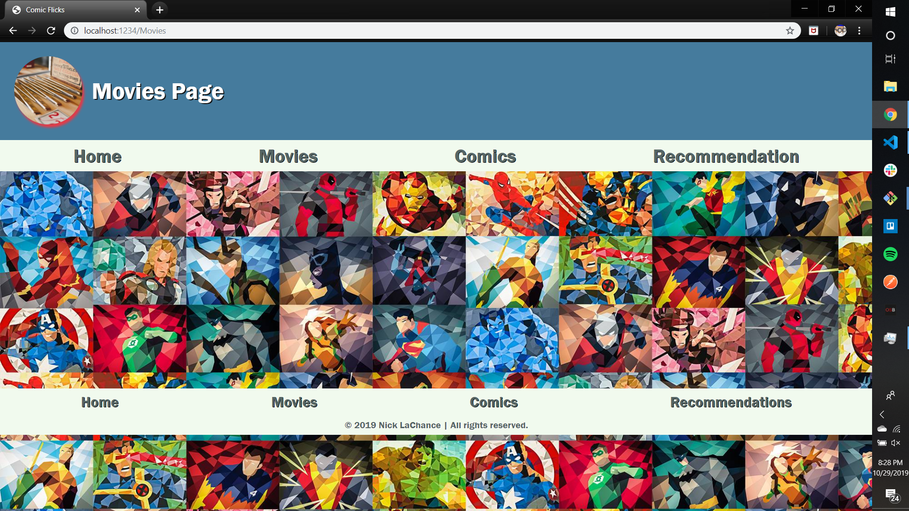
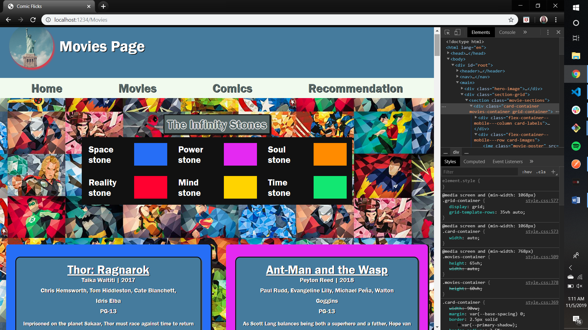
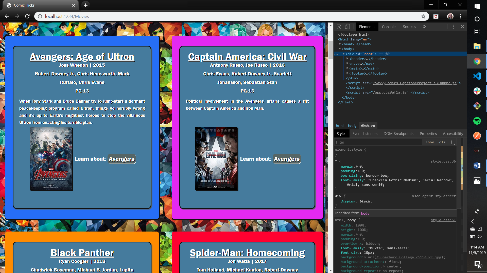
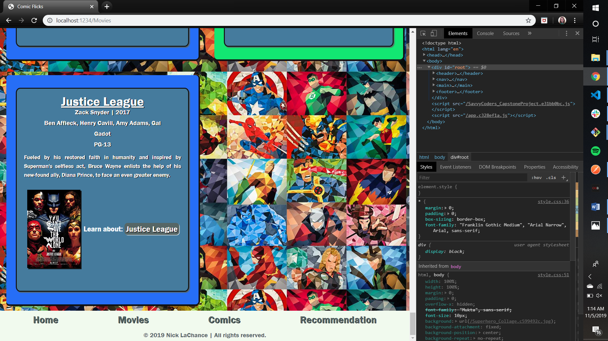
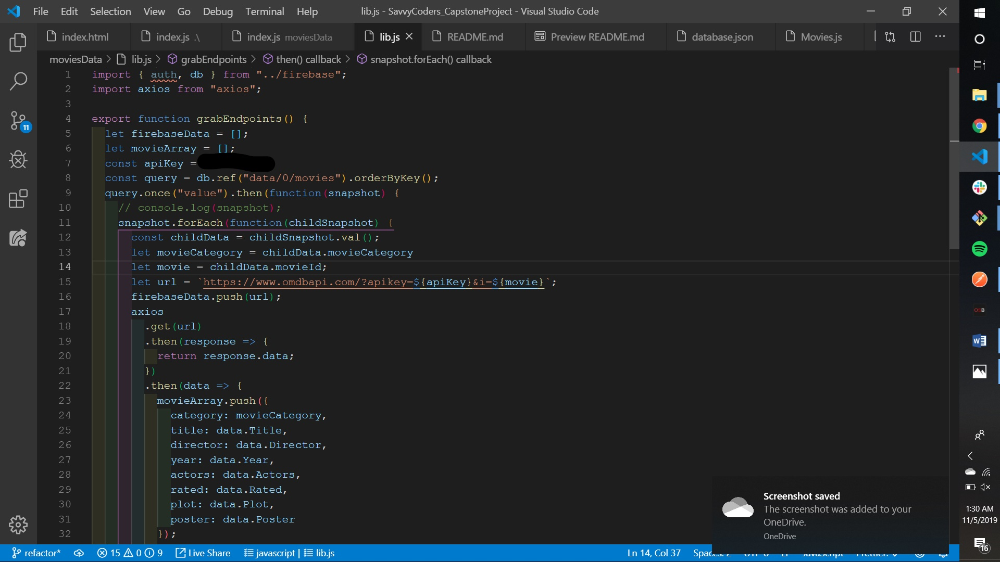
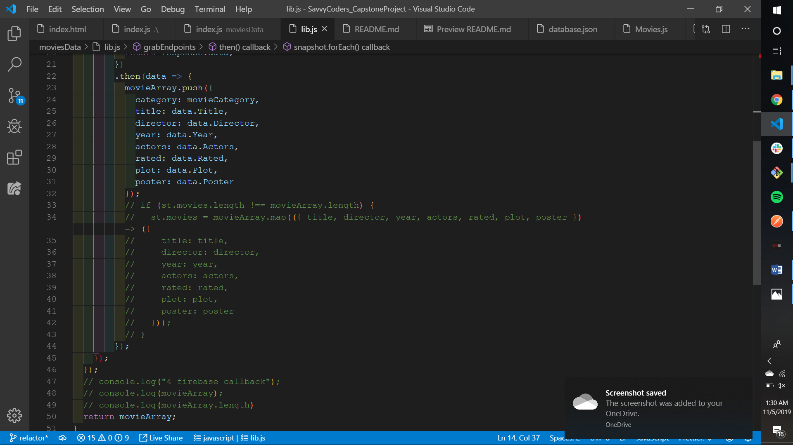

# Comic Flix | all-in-one **comic book movie** website
## Nick La Chance SavvyCoders August 2019 Cohort
### SavvyCoders_CapstoneProject

#### Netlify link https://admiring-babbage-662568.netlify.com/   ***Working site***
___

**This website** is designed to direct a consumer of Comic Books and Comic Book Movies to the proper sequence for watching Comic Books movies, and where to find more information on the characters. This website is designed to address both *Marvel* and *DC* movies, as well as some other publishers like *Image* and *Dark Horse*.

**Here are images of my project, there is code, the website itself, and misc. items.**

### *Here the movies page did NOT want to render anything*

### *Here is the movie page after getting some HTML to dynamically render*

### I had to use firebase and axios to pull from an API to get my data

